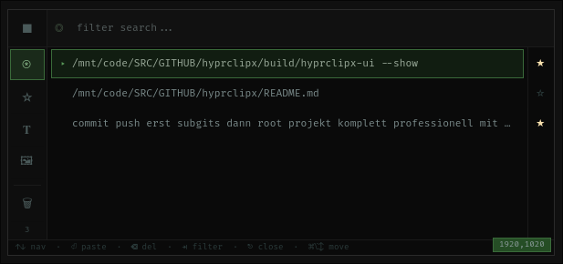

# HyprClipX

[](LICENSE) &nbsp; [](https://hyprland.org) &nbsp; [](https://en.cppreference.com/w/cpp/23) &nbsp; [](CMakeLists.txt)

A Hyprland plugin for a **layer-shell clipboard manager** with smart paste, caret positioning and filter tabs.



## Overview

HyprClipX is a 1:1 port of the AGS clipboard manager to native C++. It runs as a GTK4 layer-shell overlay positioned at the text cursor (caret), with intelligent paste detection for terminals, browsers, kitty, and XWayland apps.

```
┌─────────────────────────────────────────────────────────────────┐
│ Hyprland Compositor                                             │
│   hyprclipx.so plugin (no GTK, no threads, no blocking)        │
│     → dispatchers, IPC, fork+exec                               │
└──────────────────────┬──────────────────────────────────────────┘
                       │ fork() + execlp()
                       ▼
┌─────────────────────────────────────────────────────────────────┐
│ hyprclipx-ui (standalone Wayland client)                        │
│   GTK4 + gtk4-layer-shell overlay window                        │
│     → filter tabs, search, keyboard nav, smart paste            │
└──────────────────────┬──────────────────────────────────────────┘
                       │ Unix socket IPC
                       ▼
┌─────────────────────────────────────────────────────────────────┐
│ clipman-daemon.py (SQLite clipboard storage)                    │
│   → list, paste, favorite, delete, clear                        │
└─────────────────────────────────────────────────────────────────┘
```

## Features

### Clipboard Management
- **Persistent history** - Clipboard entries stored in SQLite via clipman-daemon
- **Text and image support** - Handles both content types with preview
- **Favorites** - Star entries to keep them permanently
- **Search** - Filter entries by content in real-time
- **Filter tabs** - All / Favorites / Text / Images (cycle with Tab)

### Smart Paste
- **Caret positioning** - Window appears at text cursor via AT-SPI
- **Terminal detection** - Pastes with Ctrl+Shift+V (foot, alacritty, wezterm, ...)
- **Kitty remote paste** - Uses kitty remote control protocol with automatic fallback
- **Browser detection** - Pastes with delay + Ctrl+V (Firefox, Chromium, ...)
- **XWayland support** - Uses xdotool for X11 apps (JetBrains IDEs, etc.)
- **Previous window restore** - Focus returns to the original window after paste

### Keyboard Navigation
- **Arrow keys** - Navigate clipboard entries
- **Enter** - Paste selected entry
- **Delete** - Remove entry from history
- **Ctrl+F** - Toggle favorite
- **Tab** - Cycle filter tabs
- **Escape** - Close window
- **Arrow Left/Right** - Adjust caret offset

### Layer-Shell Overlay
- **Dark theme** - HyprZones-inspired dark UI with rounded corners
- **Positioned at caret** - Follows text cursor position
- **Offset persistence** - Remembers custom offset between sessions
- **Auto-hide** - Closes after paste or on Escape

## Installation

### Using hyprpm (Recommended)

```bash
hyprpm add https://github.com/azzuriel/hyprclipx
hyprpm enable hyprclipx
hyprpm reload
```

### Manual Build

#### Requirements

| Package | Arch Linux | Description |
|---------|------------|-------------|
| Hyprland 0.53+ | `hyprland` | Wayland compositor with headers |
| CMake 3.19+ | `cmake` | Build system |
| GCC 13+ / Clang 17+ | `gcc` | C++23 compiler |
| pkg-config | `pkgconf` | Dependency resolver |
| GTK4 | `gtk4` | UI toolkit (for hyprclipx-ui) |
| Gtk4LayerShell | `gtk4-layer-shell` | Wayland layer shell for GTK4 |
| Pango | `pango` | Text rendering |
| Cairo | `cairo` | 2D graphics |

#### Runtime Dependencies

| Package | Arch Linux | Description |
|---------|------------|-------------|
| wl-clipboard | `wl-clipboard` | Wayland clipboard access (`wl-copy`) |
| wtype | `wtype` | Wayland keyboard simulation |
| xdotool | `xdotool` | X11 keyboard simulation (for XWayland apps) |
| Python 3 | `python` | AT-SPI caret position helper |

#### Arch Linux

```bash
# Build dependencies
sudo pacman -S hyprland cmake gcc pkgconf gtk4 gtk4-layer-shell pango cairo

# Runtime dependencies
sudo pacman -S wl-clipboard wtype xdotool python
```

#### Build

```bash
git clone https://github.com/azzuriel/hyprclipx
cd hyprclipx
./build.sh
```

#### Install

```bash
./build.sh install
# Installs hyprclipx.so to /usr/lib/hyprland/plugins/
# Install hyprclipx-ui to PATH:
sudo cp build/hyprclipx-ui /usr/local/bin/
```

Add to `~/.config/hypr/hyprland.conf`:

```ini
plugin = /usr/lib/hyprland/plugins/hyprclipx.so
```

## Configuration

Add to `~/.config/hypr/hyprland.conf`:

```ini
# Plugin settings
plugin:hyprclipx:enabled = 1
plugin:hyprclipx:hotkey = SUPER V

# Keybinding
bind = $mainMod, V, hyprclipx:toggle
```

## Usage

### Keybindings

Add to `~/.config/hypr/hyprland.conf`:

```ini
# Toggle clipboard manager
bind = $mainMod, V, hyprclipx:toggle

# Show / Hide
bind = $mainMod SHIFT, V, hyprclipx:show
bind = , Escape, hyprclipx:hide
```

### IPC Commands

```bash
# Toggle clipboard window
hyprctl dispatch hyprclipx:toggle

# Show / Hide
hyprctl dispatch hyprclipx:show
hyprctl dispatch hyprclipx:hide

# Via hyprctl command interface
hyprctl hyprclipx toggle
hyprctl hyprclipx show
hyprctl hyprclipx hide
hyprctl hyprclipx reload
```

### Keyboard Controls (Inside Clipboard Window)

| Key | Action |
|-----|--------|
| Up / Down | Navigate entries |
| Enter | Paste selected entry |
| Delete | Remove entry |
| Ctrl+F | Toggle favorite |
| Tab | Cycle filter (All → Favorites → Text → Images) |
| Left / Right | Adjust caret offset |
| Escape | Close window |

## Smart Paste Detection

HyprClipX detects the target window type and uses the appropriate paste method:

| Window Type | Paste Method | Detection |
|-------------|-------------|-----------|
| Terminal (foot, alacritty, ...) | `wtype` Ctrl+Shift+V | Window class matching |
| Kitty | `kitty @ paste-to-window` | Window class + remote control |
| Browser (Firefox, Chromium, ...) | `wtype` Ctrl+V (100ms delay) | Window class matching |
| XWayland (JetBrains, ...) | `xdotool` Ctrl+Shift+V | `xwayland == true` |
| Default | `wtype` Ctrl+V | Fallback |

See [docs/ARCH_HYPRCLIPX_PASTE.md](docs/ARCH_HYPRCLIPX_PASTE.md) for the full paste architecture.

## Project Structure

```
hyprclipx/
├── include/hyprclipx/          # Header files
│   ├── Config.hpp              # Plugin configuration
│   ├── ClipboardEntry.hpp      # Clipboard entry data structure
│   ├── ClipboardManager.hpp    # clipman-daemon IPC client
│   ├── ClipboardRenderer.hpp   # GTK4 layer-shell UI
│   ├── ConfigParser.hpp        # Hyprland config reader
│   ├── IPCHandler.hpp          # hyprctl command handling
│   ├── Globals.hpp             # Plugin globals
│   └── Forward.hpp             # Forward declarations
├── src/
│   ├── main.cpp                # Plugin entry (dispatchers, IPC, lifecycle)
│   ├── Globals.cpp             # Caret capture, fork+exec UI
│   ├── IPCHandler.cpp          # hyprctl command routing
│   ├── ConfigParser.cpp        # Config value parsing
│   ├── main_ui.cpp             # UI binary entry (socket listener, GTK loop)
│   ├── ClipboardRenderer.cpp   # GTK4 window, CSS, widgets, smart paste
│   └── ClipboardManager.cpp    # Unix socket IPC to clipman-daemon
├── docs/
│   └── ARCH_HYPRCLIPX_PASTE.md # Smart paste architecture
├── build.sh                    # Build script
├── CMakeLists.txt              # Two targets: .so plugin + UI binary
├── CLAUDE.md                   # AI assistant guidelines
└── README.md
```

## Troubleshooting

### Clipboard window doesn't appear

1. Check if plugin is loaded: `hyprctl plugins list`
2. Check if UI binary is in PATH: `which hyprclipx-ui`
3. Check if clipman-daemon is running: `ls /tmp/clipman.sock`
4. Try manual toggle: `hyprctl dispatch hyprclipx:toggle`

### Paste not working

1. Check paste dependencies: `which wtype wl-copy xdotool`
2. Install missing: `sudo pacman -S wl-clipboard wtype xdotool`
3. For kitty: enable remote control in `kitty.conf`:
   ```
   allow_remote_control yes
   listen_on unix:/tmp/kitty-{kitty_pid}
   ```

### Window appears at wrong position

1. AT-SPI may not be running - install `at-spi2-core`
2. Check caret helper: `python3 ~/.config/iconmanager/helpers/get-caret-position.py`
3. Use Left/Right arrow keys inside the clipboard window to adjust offset

### Plugin freezes compositor

This should not happen with the current architecture (plugin has no GTK, no threads). If it does:
1. Switch to TTY: Ctrl+Alt+F2
2. Remove plugin: `sed -i '/hyprclipx/d' ~/.config/hypr/hyprland.conf`
3. Restart Hyprland

## License

BSD 3-Clause License (same as Hyprland)

## Credits

- 1:1 port of the [AGS clipboard manager](https://github.com/Aylur/ags)
- Built for [Hyprland](https://hyprland.org)
- Smart paste architecture inspired by the original iconmanager templates
